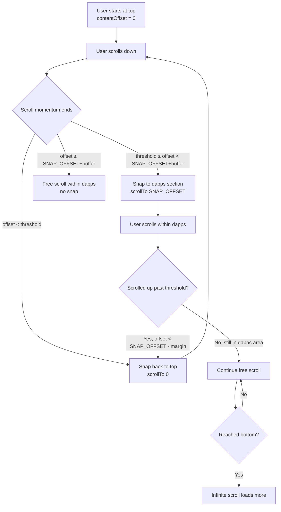

# Dashboard Snap Scroll Plan

## Overview

Add a snap scroll behavior to the Dashboard so that:
1. The page **starts at the top** (hero visible)
2. When the user scrolls **past a threshold**, it **snap scrolls** to position the "Available Dapps" section just below the sticky search bar
3. Once at the dapps section, the user can **scroll freely** within it without snapping back

## Current Layout (in `src/screens/DashboardScreen.tsx`)

```
┌─────────────────────────────────┐
│        HeaderBar (fixed)        │  ← not part of ScrollView
├─────────────────────────────────┤
│        Hero Section             │  ← index 0, height = SCREEN * 0.35
│        (Logo, fades out)        │
├─────────────────────────────────┤
│    Sticky Search Bar (44px)     │  ← index 1, sticks via stickyHeaderIndices
├─────────────────────────────────┤
│  "Scroll to browse" indicator   │  ← index 2, ~52px (with padding/text/chevron)
├─────────────────────────────────┤
│          SPACER                 │  ← index 3, DAPPS_SPACER height
├─────────────────────────────────┤
│        Dapp Rows                │  ← index 4+, infinite scroll
└─────────────────────────────────┘
```

### Key Measurements

| Item | Calculation | Value |
|------|-------------|-------|
| `HERO_SECTION_HEIGHT` | `SCREEN_HEIGHT * 0.35` | ~varies |
| `SEARCH_BAR_HEIGHT` | constant | `44` |
| `INDICATOR_HEIGHT` | estimated (2×padding + text + chevron) | ~`52` |
| `DAPPS_SPACER` | `SCREEN_HEIGHT - HERO_SECTION_HEIGHT - SEARCH_BAR_HEIGHT - 64` | ~varies |
| `DAPPS_SNAP_OFFSET` | `HERO_SECTION_HEIGHT + INDICATOR_HEIGHT + DAPPS_SPACER` | ≈ `SCREEN_HEIGHT - 56` |

## Snap Behavior Design

### Snap Points

```
Snap Point 0: contentOffset.y = 0         → Hero visible, search bar at rest position
Snap Point 1: contentOffset.y = SNAP_OFFSET → Dapps visible, search bar stuck at top
```

### Threshold Logic

- **`SNAP_THRESHOLD`** = `SNAP_OFFSET * 0.35` (35% of the way to dapps)
- If `contentOffset.y < SNAP_THRESHOLD` → snap to **top** (Point 0)
- If `contentOffset.y >= SNAP_THRESHOLD` and `contentOffset.y < SNAP_OFFSET + buffer` → snap to **dapps** (Point 1)
- If `contentOffset.y >= SNAP_OFFSET + buffer` → **free scroll** within dapps (no snap back)

### Flow Diagram



## Implementation Plan

### Step 1: Add imports and refs
- Import `useRef` (already imported) and add `scrollViewRef`
- Add `NativeScrollEvent`, `NativeSyntheticEvent` types if needed

### Step 2: Calculate snap constants outside the component
- `INDICATOR_HEIGHT = 52` (estimated, or better yet use `onLayout`)
- `DAPPS_SNAP_OFFSET` based on the formula above
- `SNAP_THRESHOLD = DAPPS_SNAP_OFFSET * 0.35`
- `SNAP_BUFFER = 40` (buffer zone so free-scrolling within dapps doesn't snap back)

### Step 3: Add scrollViewRef and connect to ScrollView
- `const scrollRef = useRef<Animated.ScrollView>(null)`
- Pass `ref={scrollRef}` to the `Animated.ScrollView`

### Step 4: Implement `handleMomentumEnd`
```ts
const handleMomentumEnd = useCallback(
  (event: NativeSyntheticEvent<NativeScrollEvent>) => {
    const offsetY = event.nativeEvent.contentOffset.y;
    
    if (offsetY < SNAP_THRESHOLD) {
      // Snap back to top
      scrollRef.current?.getNode().scrollTo({ y: 0, animated: true });
    } else if (offsetY < DAPPS_SNAP_OFFSET + SNAP_BUFFER) {
      // Snap to dapps section
      scrollRef.current?.getNode().scrollTo({ y: DAPPS_SNAP_OFFSET, animated: true });
    }
    // else: already in dapps area, free scroll
  },
  [],
);
```

### Step 5: Wire up the event handlers on ScrollView
- Add `onMomentumScrollEnd={handleMomentumEnd}` to the `Animated.ScrollView`
- Keep existing `onScroll` for the animated tracking

### Step 6: Handle `onScrollEndDrag` for responsive snap (optional enhancement)
- If the user stops dragging without momentum, also snap
- Use `onScrollEndDrag` with similar logic

### Step 7: Consider using `onLayout` for accurate indicator height
- Add an `onLayout` callback to the indicator View to measure its actual rendered height
- Use state to store it, fall back to the estimate

### Step 8: Test edge cases
- Rapid scrolling
- Scrolling from dapps back up to hero
- Device rotation / different screen sizes
- Dark mode / light mode (no visual changes expected)

## Files to Modify

| File | Modification |
|------|-------------|
| `src/screens/DashboardScreen.tsx` | Add ref, snap constants, momentum handler, wire up to ScrollView |

## Considerations / Trade-offs

1. **`onMomentumScrollEnd` vs `onScrollEndDrag`**: Using both provides the best UX. `onMomentumScrollEnd` catches inertial scrolling; `onScrollEndDrag` catches cases where the user stops dragging without flinging.

2. **Sticky header interaction**: The search bar at index 1 is sticky. When snapping to dapps, the snap offset ensures the search bar is stuck at the top and dapps are visible just below it.

3. **Native driver**: The existing scroll animation uses `useNativeDriver: true`. The `scrollTo` calls are imperative (ref-based), so they work fine with native driver.

4. **SCROLL_THRESHOLD (80px)**: This is for the logo fade-out only, not related to snap. It should remain unchanged.

5. **Buffer zone**: Prevents annoying re-snapping when the user is already in the dapps section and scrolling within it.

## No New Dependencies Required

All necessary APIs (`Animated.ScrollView`, `scrollTo`, `onMomentumScrollEnd`) are built into React Native core.